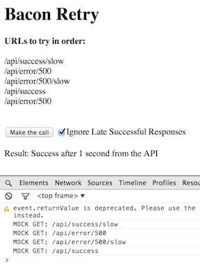
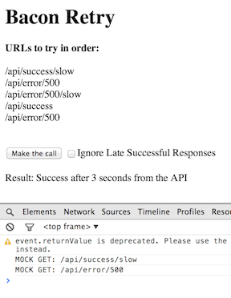
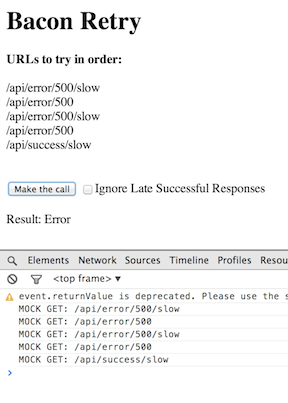

#Reactive Retry with Bacon

Using reactive streams to handle retrying service calls with a timeout. A sequence of given URLs are tried in order.
If a call gives an error, or it doesn't return within a configured timeout period then a new call to the next URL in the
sequence is made. Late successful responses can  be ignored if so desired (not the default). This is essentially the
difference between <code>flatMap</code> and <code>flatMapLatest</code>.

In the example we are mocking the
response time of normal calls as 1 second, and the response time of slow calls as 3 seconds. The timeout for
launching a call to the next URL is 2 seconds.

 

 

##Usge

        var submits = submitInteraction.element.asEventStream(submitInteraction.event).doAction('.preventDefault');

        submits.onValue(function(){
            var serviceCall = retry(urls, delayMs, $('#ignoreSlowSuccess').is(':checked'));

            serviceCall.pending.onValue(showResult, "Pending...");
            serviceCall.result.onValue(showResult);
            serviceCall.result.onError(showResult);
        });

##Code

###Stream collaboration (master branch)

        function retry(urls, delayMs, ignoreSlowSuccess) {
            urls.push(new Bacon.End());
            var start = new Bacon.Bus()//.log();
            var success = new Bacon.Bus()//.log();
            var result = new Bacon.Bus()//.log();

            var request = start.flatMap(Bacon.once(urls.shift()).concat(Bacon.sequentially(delayMs, urls))).takeUntil(success)//.log();
            var response = request[ignoreSlowSuccess ? 'flatMapLatest' : 'flatMap'](function (val) {
                return Bacon.fromPromise($.ajax({url: val}))//.log();
            })//.log();
            success.plug(response.skipErrors().doAction(function (val) {
                result.push(val);
                result.end();
            }).map(new Bacon.End()));

            response.onEnd(function () {
                success.end();
                result.error('Error'); //it happens only if doAction did not push a success value
                result.end();
            });

            start.push(new Bacon.End());
            start.end();

            return {
                result: result,
                pending: start.awaiting(result)
            };
        }

###State Machine for state management (state-machine branch)

            function retry(urls, delayMs, ignoreSlowSuccess) {
                var state = {
                    promises: [],
                    getCount: function () {
                        return this.promises.length;
                    },
                    isAnyResolved: function () {
                        for (var i = 0; i < this.promises.length; i++) {
                            if (this.promises[i].state() == 'resolved') {
                                return true;
                            }
                        }
                        return false;
                    },
                    isResolved: function() {
                        if (this.promises.length == 0) return false;
                        return ignoreSlowSuccess ? this.getLast().state() == 'resolved' : this.isAnyResolved();
                    },
                    getFirstResolved: function () {
                        for (var i = 0; i < this.promises.length; ++i) {
                            if (this.promises[i].state() == 'resolved')
                                return this.promises[i];
                        }
                    },
                    getLast: function () {
                        return this.promises[this.promises.length - 1];
                    },
                    add: function (promise) {
                        this.promises.push(promise);
                    },
                    getHistory: function () {
                        if (this.promises.length == 0) {
                            return new Bacon.never();
                        }

                        var stream = Bacon.fromPromise(this.promises[0]);
                        if (this.promises.length > 1) {
                            for (var i = 1; i < this.promises.length; ++i) {
                                stream = stream.concat(this.promises[i]);
                            }
                        }
                        return stream;
                    },
                    getResult: function() {
                        var fr = this.getFirstResolved();
                        return Bacon.fromPromise(fr ? fr : this.getLast());
                    }
                };

                var pipe = Bacon.once(urls.shift()).concat(Bacon.sequentially(delayMs, urls))
                        .withStateMachine(state, function(state, event) {
                            if (state.isResolved() || event.isEnd()) {
                                return [state, [new Bacon.Next(state), new Bacon.End()]]
                            }
                            else {
                                state.add($.ajax({url: event.value()}));
                                return [state, [new Bacon.Next(state)]];
                            }
                        })//.log();

                return {
                    result: pipe.filter(function(state){
                        return state.isResolved() || (state.getCount() == urls.length);
                    }).flatMap(function(state){return state.getResult()}),
                    pending: pipe.filter(function(state){
                        return !(state.isResolved() || (state.getCount() == urls.length));
                    }).map(Boolean)
                };
            }