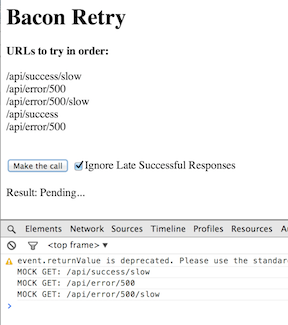

#Reactive Retry with Bacon

Using reactive streams to handle retrying service calls with a timeout. A sequence of given URLs are tried in order.
If a call gives an error, or it doesn't return within a configured timeout period then a new call to the next URL in the
sequence is made. Late successful responses can  be ignored if so desired (not the default). This is essentially the
difference between <code>flatMap</code> and <code>flatMapLatest</code>.

In the example we are mocking the
response time of normal calls as 1 second, and the response time of slow calls as 3 seconds. The timeout for
launching a call to the next URL is 2 seconds.

 

 

##Usge

        var submits = submitInteraction.element.asEventStream(submitInteraction.event).doAction('.preventDefault');

        submits.onValue(function(){
            var serviceCall = retry(urls, delayMs, $('#ignoreSlowSuccess').is(':checked'));

            serviceCall.pending.onValue(showResult, "Pending...");
            serviceCall.result.onValue(showResult);
            serviceCall.result.onError(showResult);
        });

##Code

        function retry(urls, delayMs, ignoreSlowSuccess) {
            urls.push(new Bacon.End());
            var start = new Bacon.Bus()//.log();
            var success = new Bacon.Bus()//.log();
            var result = new Bacon.Bus()//.log();

            var request = start.flatMap(Bacon.once(urls.shift()).concat(Bacon.sequentially(delayMs, urls))).takeUntil(success)//.log();
            var response = request[ignoreSlowSuccess ? 'flatMapLatest' : 'flatMap'](function (val) {
                return Bacon.fromPromise($.ajax({url: val}))//.log();
            })//.log();
            success.plug(response.skipErrors().doAction(function (val) {
                result.push(val);
                result.end();
            }).map(new Bacon.End()));

            response.onEnd(function () {
                success.end();
                result.error('Error'); //it happens only if doAction did not push a success value
                result.end();
            });

            start.push(new Bacon.End());
            start.end();

            return {
                result: result,
                pending: start.awaiting(result)
            };
        }